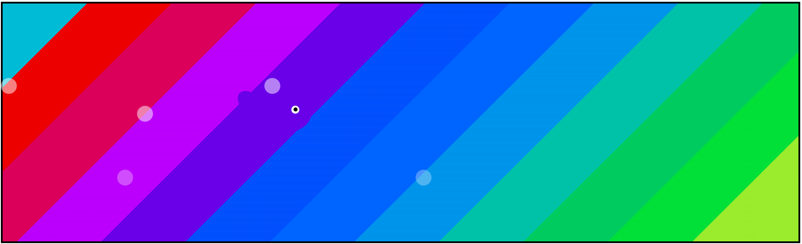
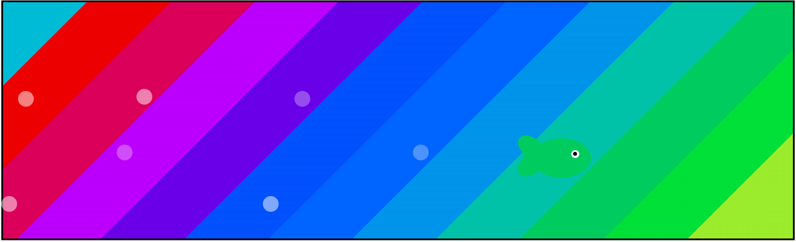

# Color-Changing-Fish
Объект меняет цвет в зависимости от фона.

## Источник вдохновения: рыбы, которые умеют менять цвет в зависимости от фона.

## Несколько вариантов:
- 'main' - базовый вариант без мимикрии с `drug-and-drop`.
- 'current' - рыба с мимикрией и с `drug-and-drop`. 
- 'animation' - анимированная рыба со сменой цвета. 

Как пользоваться: `double-click` по `html` файлу в каждой из папок.

